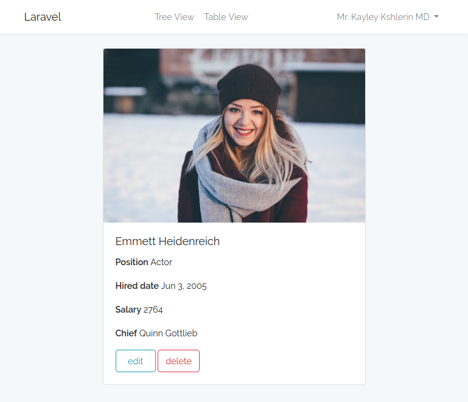
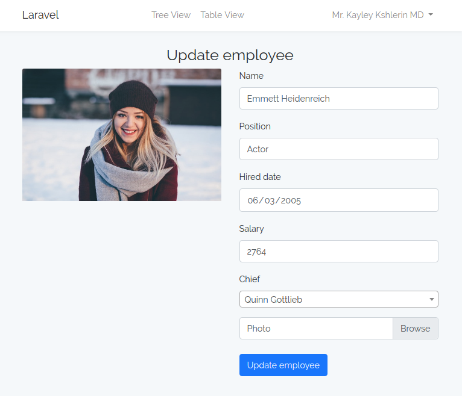
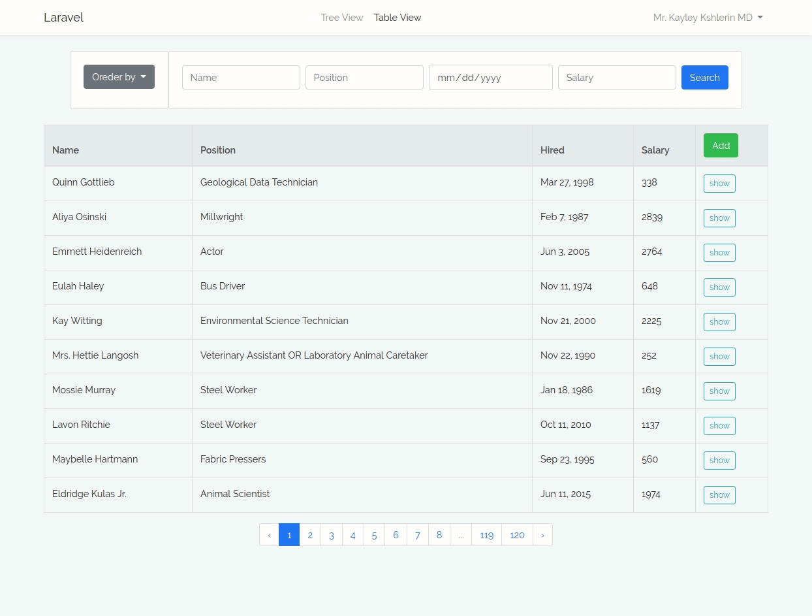
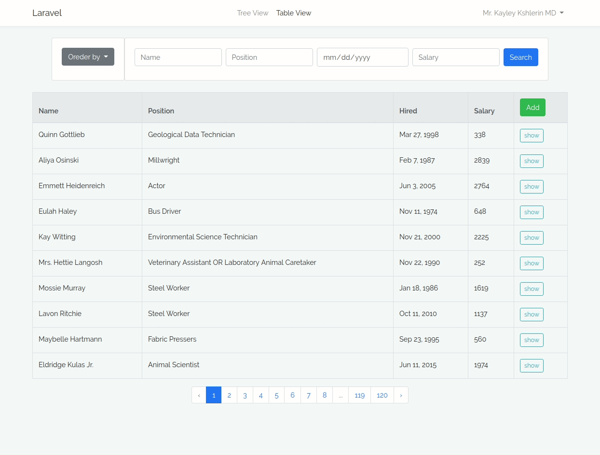

# Список сотрудников

Тестовое задание abz.agency. Полный текст задания в [pdf](abz.pdf).

## Что получилось

Есть таблица, содержащая данные о сотрудниках (ФИО, должность и пр.), каждый из которых имеет начальника.

При добавлении сотрудника можно указать его начальника и добавить фото (генерируется thumbnail). 

Начальника можно изменить в дальнейшем. При выборе начальника используется ajax.

Список сотрудников выводится в 2 разных видах:
- иерархический (начальник-сотрудник)
- табличный

Табличный вид выводит информацию о сотрудниках и имеет пагинацию, сортировку, форму поиска по всем полям.

Данные получаются путем ajax запроса.

Иерархический вид отображает имя сотрудника, должность и уменьшеную копию фото. Реализована "ленивая" загрузка (ajax), когда следующий уровень подгружается после клика.

Данные страницы доступны зарегистрированным пользователям. 

Созданы файлы миграции для базы данных и seeder для её заполнения. Написаны тесты на CRUD, доступность зарегистрированным пользователям, загрузки фото и генерации thumbnail.

Использованные библиотеки bootstrap 4, intervention/image, select2 подключены через composer и npm, использован laravel mix.

## Что еще пока не реализовано

 - Drag'n'Drop в дереве сотрудников
 - Файл проекта Workbench
 
## Установка
Требуется расширение php gd. 

Устанавливается как типовое приложение Laravel. Для локальной установки можно использовать [этот](https://github.com/deeem/docker-environments/tree/laravel) docker-контейнер.

- npm install
- composer install
- artisan storage:link
- artisan migrate --seed
